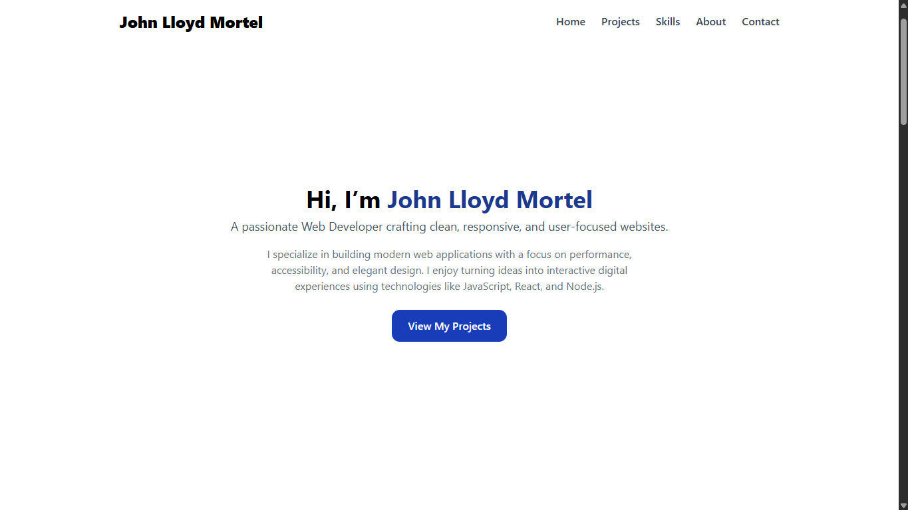

<h1 align="center">🌐 John Lloyd Mortel — Portfolio</h1>

<p align="center">
  A clean and responsive personal portfolio built with <b>React.js</b> and <b>Tailwind CSS</b>.<br>
  Showcasing my projects, skills, and background as a web developer.
</p>

<p align="center">
  <a href="https://johnlloydmortel.vercel.app/" target="_blank">
    🔗 <b>Live Demo</b>
  </a> |
  <a href="https://github.com/johndev08/Portfolio" target="_blank">
    💻 <b>Repository</b>
  </a>
</p>

---

<h2>🚀 Features</h2>

<ul>
  <li>Fully responsive and mobile-friendly layout</li>
  <li>Built with React.js and Tailwind CSS</li>
  <li>Modern and minimal UI design</li>
  <li>Sections for Projects, Skills, About, and Contact</li>
  <li>Includes View and Download Resume functionality</li>
</ul>

---

<h2>🛠️ Tech Stack</h2>

<ul>
  <li><b>Frontend:</b> React.js, Tailwind CSS</li>
  <li><b>Deployment:</b> Vercel</li>
</ul>

---

<h2>📂 Sections</h2>

<ul>
  <li><b>Home</b> – Introduction and tagline</li>
  <li><b>Projects</b> – Showcases <i>Five Star Chicken</i>, <i>Balai</i>, <i>Pasakay</i>, and this portfolio</li>
  <li><b>Skills</b> – Core tools and technologies</li>
  <li><b>About</b> – Personal background and short bio</li>
  <li><b>Contact</b> – Simple and direct way to reach out</li>
</ul>

---

<h2>📸 Preview</h2>

<p align="center">
  
</p>

---

<h2>⚙️ Run Locally</h2>

```bash
git clone https://github.com/johndev08/Portfolio.git
cd Portfolio
npm install
npm run dev
>>>>>>> 5912c8433017c12cf96fc8f2a6563246f3a4b33e
